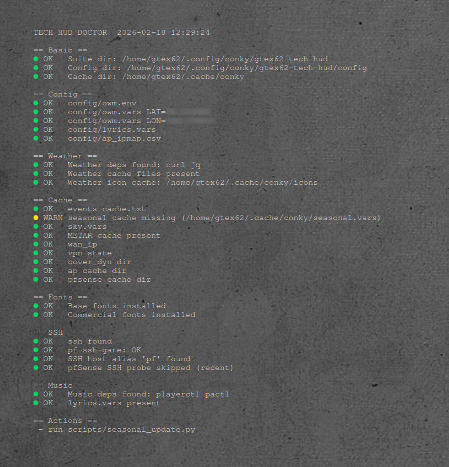

# gtex62-tech-hud

Conky suite focused on a **central clock** with layered visual elements, a **celestial volvelle ring**, and a bottom HUD for weather + status panels.

## Table of Contents

- [gtex62-tech-hud](#gtex62-tech-hud)
  - [Table of Contents](#table-of-contents)
  - [Screenshots](#screenshots)
  - [Features](#features)
  - [Requirements](#requirements)
  - [Installation](#installation)
    - [1. Install Conky + dependencies](#1-install-conky--dependencies)
    - [2. Clone this repo](#2-clone-this-repo)
    - [3. Install fonts](#3-install-fonts)
  - [Quick Start](#quick-start)
  - [Folder Structure](#folder-structure)
  - [Customization](#customization)
  - [Widgets](#widgets)
    - [Center Clock](#center-clock)
    - [Volvelle Ring (Celestial Glyph Ring)](#volvelle-ring-celestial-glyph-ring)
    - [Weather Widget](#weather-widget)
    - [SITREP Panel](#sitrep-panel)
    - [System Circle](#system-circle)
    - [Network Circle](#network-circle)
    - [Notes Panel](#notes-panel)
    - [Music + Lyrics Panel](#music--lyrics-panel)
    - [pfSense Arcs (Centered)](#pfsense-arcs-centered)
    - [Station Model (METAR)](#station-model-metar)
    - [Baro Gauge](#baro-gauge)
    - [Calendar Ring (Seasons)](#calendar-ring-seasons)
    - [Calendar Marquee (Top Arc)](#calendar-marquee-top-arc)
    - [Font Probe (Eurostile)](#font-probe-eurostile)
    - [Doctor (Diagnostics)](#doctor-diagnostics)
  - [Troubleshooting](#troubleshooting)
  - [Performance Notes](#performance-notes)
  - [Compatibility](#compatibility)
  - [Credits](#credits)
  - [License](#license)

## Screenshots

- Full suite image: `screenshots/gtex62-tech-hud.png` — 
- SITREP panel widget: `screenshots/sitrep.png` — 
- Doctor widget: `screenshots/doctor.png` — 

## Features

- Central clock with analog hands + 24h bezel + digital readouts
- Celestial volvelle ring (sun/moon/planets) driven by cached astronomy values
- Bottom HUD weather widget with horizon arc + forecast tiles + aviation text blocks
- Optional SITREP panel (compact system/network/AP/pfSense summary; no arcs)
- Standalone SYS + NET circles (meters + labels; consistent styling)
- Music + lyrics panel (playerctl + optional online/offline lyric providers)
- pfSense centered arcs (WAN/HOME/IOT/etc) with SSH safety gate
- Station model (METAR) + baro gauge + seasonal tint system
- Calendar ring + calendar marquee (events cache, DST markers, seasonal boundaries)

## Requirements

Core:

- Conky with Lua + Cairo support (e.g., `conky-all` on Debian/Ubuntu/Mint)
- `fontconfig` (font detection helpers)

Common utilities (used by several widgets/scripts):

- `bash`, `curl`, `jq`
- `playerctl` (music metadata)
- `lm-sensors` (temps; optional but recommended)
- `pulseaudio-utils` (optional; volume/mute via `pactl`)

Optional:

- `python3` + `python3-ephem` (astronomy/event generation)
- SSH access to pfSense and/or APs (for SITREP + pfSense/AP widgets)

Fonts: Bundled fonts are installed by: scripts/install-fonts.sh.  Commercial fonts are optional and not included.  See [Install fonts](#3-install-fonts) for the helper script and [Troubleshooting](#troubleshooting) for Eurostile name updates.

Per-widget dependencies are called out in the [Widgets](#widgets) section.

## Installation

### 1. Install Conky + dependencies

Debian/Ubuntu/Mint example:

```bash
sudo apt update
sudo apt install -y conky-all fontconfig curl jq lm-sensors playerctl pulseaudio-utils python3 python3-ephem
sudo sensors-detect || true
```

### 2. Clone this repo

```bash
mkdir -p ~/.config/conky
cd ~/.config/conky
git clone https://github.com/GTex62/gtex62-tech-hud.git
```

### 3. Install fonts

Run the helper to install bundled fonts and refresh the cache:

```bash
bash "$HOME/.config/conky/gtex62-tech-hud/scripts/install-fonts.sh"
```

Note: The script does not install commercial fonts (Eurostile LT Std Ext Two, Eurostile LT Std, Berthold City Light, Berthold City). If you have those installed, the helper will detect and use them.

## Quick Start

- Copy the `config/*.example` files to their non-`.example` names (e.g., `config/owm.env`, `config/owm.vars`, `config/lyrics.vars`) and set the values inside.
- Set `CONKY_SUITE_DIR` and `CONKY_CACHE_DIR` in `scripts/conky-env.sh` (defaults point to the standard locations).
- Run the suite from `scripts/run-time.sh` or `scripts/start-conky.sh` (they source `conky-env.sh`).
- Main configs live in `widgets/`.
- Shared palette/fonts live in `lua/lib/theme-core.lua` and are referenced by `theme.lua`, `theme-pf.lua`, and `theme-sitrep.lua`.

Common overrides (edit `scripts/conky-env.sh`):

```bash
export CONKY_SUITE_DIR="$HOME/.config/conky/gtex62-tech-hud"   # where the suite lives
export CONKY_CACHE_DIR="$HOME/.cache/conky"                   # cache location
export PFSENSE_HOST="192.168.1.1"                             # optional
export AP_IPS="192.168.1.2,192.168.1.3"                       # optional
export AP_LABELS="Closet,Office"                              # optional
export WD_BLACK_PATH="/mnt/WD_Black"                          # optional extra disk mount
```

Note: `WD_BLACK_PATH` only changes which filesystem is measured. The label text comes from `theme.lua` → `system.disk_label.wd_label` (defaults to `/WD_BLACK`), so change that too if you want it to display `/NAS`, etc.

## Folder Structure

Installed under your home config (or `${CONKY_SUITE_DIR:-~/.config/conky/gtex62-tech-hud}` if overridden):

```text
${CONKY_SUITE_DIR:-~/.config/conky/gtex62-tech-hud}/
├── config/                  # env/vars/examples (OWM, lyrics, events, ip maps, etc.)
├── fonts/
├── icons/
├── lua/                     # widget renderers + shared modules
│   └── lib/                 # theme core, helpers, shared drawing utils
├── screenshots/
├── scripts/                 # cache generators, fetchers, SSH polling, safety gates
├── wallpapers/
├── widgets/                 # conky configs (.conky.conf)
├── README-pfsense-widget.md
├── README.md
├── theme-pf.lua
├── theme-sitrep.lua
└── theme.lua
```

## Customization

Start here:

- **Layout / placement**: edit each `widgets/*.conky.conf` (`alignment`, `gap_x`, `gap_y`, `minimum_width/height`)
- **Global look (fonts/colors/alpha)**: edit `theme.lua` (and `lua/lib/theme-core.lua` for shared palette/fonts)
- **pfSense arcs look/geometry**: edit `theme-pf.lua`
- **SITREP styling + overrides**: edit `theme-sitrep.lua`
- **Environment paths + optional devices**: edit `scripts/conky-env.sh`

Tip: keep cache directories separated per suite if you run multiple suites:

- set `CONKY_CACHE_DIR` uniquely, and
- set `weather.icon_cache_dir` to a suite-specific subdir to avoid icon collisions.

---

## Widgets

### Center Clock

- **Purpose**: Central time display with analog hands, 24h bezel, and digital readouts.
- **Dependencies**: Conky (Lua + Cairo), OWM cache for bezel auto-offset (optional).
- **Config snippet**:

  ```ini
  lua_load = '${env CONKY_SUITE_DIR}/lua/widgets/core.lua'
  lua_draw_hook_pre = 'draw_center_pre'
  ```

- **Usage notes**:
  - Theme knobs live in `theme.lua` under the `clock_*` keys.
  - `clock_bezel_auto=true` uses OWM timezone from cache (forecast or current), falls back to `TZ` in `config/owm.vars`, then `clock_bezel_utc_offset`.
  - Use `conky_core_time` if you want the clock without the marquee.
  - `clock_bezel_r_offset` adjusts the 24h bezel ring radius.
  - `clock_bezel_seg_thick` and `clock_bezel_seg_gap` control 24h bezel segment thickness and spacing.
  - `clock_numbers_weight` toggles clock numbers between `"normal"` and `"bold"`.
  - `clock_hour_tick_len`, `clock_hour_tick_width`, and `clock_hour_tick_r_offset` control the maroon hour tick length, thickness, and radius.
  - `clock_bezel_outer_ring_offset`, `clock_bezel_outer_ring_width`, `clock_bezel_outer_ring_alpha`, and `clock_bezel_outer_ring_color` control the thin maroon ring outside the bezel segments.
  - `clock_bezel_marker_color` and `clock_bezel_marker_alpha` control the 0/24 triangle marker color and opacity.
  - Date window sits just inside 3 o'clock and shows the local day-of-month; see `clock_date_window_*` knobs.
  - `clock_hand_gmt_inner_offset` sets the GMT hand start offset from the center (px).

### Volvelle Ring (Celestial Glyph Ring)

- **Purpose**: Planet/sun/moon glyphs on a ring around the center clock.
- **Dependencies**: `$CONKY_CACHE_DIR/sky.vars` (from `sky_update.py`), symbol-capable font.
- **Config snippet**:

  ```ini
  lua_load = '${env CONKY_SUITE_DIR}/lua/widgets/core.lua'
  lua_draw_hook_post = 'draw_volvelle_ring'
  ```

- **Usage notes**:
  - Theme knobs live in `theme.lua` under `volvelle`.
  - `volvelle.glyph_set` selects `astronomicon` (Q–W mapping) or `unicode` (☉☽☿♀♂♃♄); `volvelle.font="auto"` uses `font_astronomicon` or `font_unicode` accordingly.
  - `volvelle.debug_mode` and `volvelle.debug_theta` can override positions for testing.
  - Moon placement uses `MOON_RISE_TS`/`MOON_SET_TS` (and `MOON_SET_PREV_TS`) from `sky.vars` to keep the moon moving CCW: east (3 o'clock) → west (9 o'clock) above the horizon, then west → east along the bottom arc; midnight-wrap rise/set pairs are handled.
  - Set `volvelle.planet_render = "circles"` to render planets as filled circles (sun/moon remain glyphs); adjust `volvelle.planet_circles` for sizes/colors.

Generator script: `scripts/sky_update.py` calculates current azimuth/altitude for the Moon and planets, converts positions to horizon-arc angles, and writes values into `${CONKY_CACHE_DIR:-${XDG_CACHE_HOME:-~/.cache}/conky}/sky.vars` for `lua/widgets/owm.lua` to consume.

Manual test:

```bash
${CONKY_SUITE_DIR:-$HOME/.config/conky/gtex62-tech-hud}/scripts/sky_update.py
```

Automatic updates: `scripts/run-time.sh` runs the generator once each time the suite starts. For live tracking between restarts, run it periodically (for example via a systemd user timer).

### Weather Widget

- **Purpose**: Bottom HUD weather section with mirrored brackets, horizon arc, and forecast tiles.
- **Dependencies**: OpenWeather cache (`config/owm.env`, `config/owm.vars`), `jq`, `curl`, and scripts in `scripts/` (`owm_fetch.sh`, `owm_fc_icons.sh`, `owm_fc_reduce.sh`, `owm_current_icon.sh`, plus METAR/TAF helpers).
- **Config snippet**:

  ```ini
  lua_load = '${env CONKY_SUITE_DIR}/lua/widgets/weather.lua'
  lua_draw_hook_pre = 'draw_weather_widget'
  ```

- **Usage notes**:
  - Theme knobs live in `theme.lua` under `weather_widget`, `weather`, `horizon_labels`, and `weather_markers`.
  - The OpenWeather API key is required; create one on the OpenWeather website and set `OWM_API_KEY` in `config/owm.env` (copy from `config/owm.env.example`).
  - The widget uses the icon set from `weather.icon_set` in `theme.lua` (default `icons/owm`) and writes current/forecast icons to `$CONKY_CACHE_DIR/icons` or `weather.icon_cache_dir`.
  - `weather.icon_set` accepts `owm`, `owm_default`, `owm_color`, `owm_filled`, or `owm_maroon` (folder under `icons/`) or an absolute path.
  - `weather.icon_cache_dir` can be set to a subdir under `$CONKY_CACHE_DIR` (e.g., `icons/gtex62-tech-hud`) or an absolute path to avoid cross-suite icon reuse.
  - `widgets/time.conky.conf` runs the cache/scripts via `execi` entries.
  - Troubleshooting: forecast tiles need `$CONKY_CACHE_DIR/owm_forecast.json` (from `scripts/owm_fetch.sh`) and `$CONKY_CACHE_DIR/owm_days.vars` (from `scripts/owm_fc_reduce.sh`). If tiles are missing, check `$CONKY_CACHE_DIR/owm_fetch.log`, verify `jq`/`curl` are installed, and confirm `config/owm.env`/`config/owm.vars` plus `CONKY_CACHE_DIR` are set correctly.
  - `weather.vline.color` uses an RGB table; `weather.vline.alpha` controls opacity.
  - Forecast strip is centered on the clock; use `weather.forecast.x_offset` and `weather.forecast.y_offset` to position it.
  - The first forecast tile (today) shows the current temp if it exceeds the forecast high; after the current temp reaches the displayed high and then falls below the observed peak, the high displays as `-` (state persists in `$CONKY_CACHE_DIR/owm_day0_peak.vars` and resets on date change).
  - The forecast reducer skips days before local today (city timezone) and clamps `D0_HI` to the current temp when `owm_current.json` is available.
  - Use `weather_widget.*_offset_{x,y}` knobs to nudge the icon, city, temp, and humidity from the clock center independently.
  - City styling uses `weather_widget.city_font`, `weather_widget.city_size`, `weather_widget.city_color`, and `weather_widget.city_alpha`.
  - Temp/humidity styling uses `weather_widget.temp_*` and `weather_widget.humidity_*`.
  - Aviation text layout uses `weather.metar|taf|advisories` for x/y offsets, with shared styling under `weather.aviation_style`.
  - Set `weather.aviation_style.auto_stack=true` to stack TAF/advisories under METAR based on visible line count; `gap_lines` inserts blank lines between blocks.
  - Weather elements anchor to the clock center via `weather_widget.center_*` (no separate `weather.center`).
  - Forecast font uses `weather.forecast.font = "auto"` to map to `fonts.value_c`, and `weather.forecast.font_size` controls its size.
  - Forecast temps can use a separate font via `weather.forecast.temps.font` (default "auto" = `fonts.value_c`) and `weather.forecast.temps.weight` for bold/normal.
  - `weather.forecast.date.dy` now offsets only the date line; weekday stays anchored.

### SITREP Panel

- **Purpose**: Compact system + network + AP + pfSense status panel (no arcs).
- **Dependencies**: `scripts/mint_version.sh`, `scripts/wan_ip.sh`, `scripts/wan_read.sh`, `scripts/net_extras.sh`, `scripts/ap_status_all_clients.sh`, `scripts/ap_clients_named.sh`, `scripts/pf-fetch-basic.sh`, `scripts/pf-ssh-gate.sh` (SSH access required for pfSense/APs).
- **Config snippet**:

  ```ini
  lua_load = '${env CONKY_SUITE_DIR}/lua/widgets/sitrep.lua'
  lua_draw_hook_pre = 'draw_sitrep'
  ```

- **Usage notes**:
  - Theme knobs live in `theme-sitrep.lua` under `sitrep`.
  - Arc visuals live in `theme-pf.lua`, while SITREP data blocks live in `theme-sitrep.lua` so the arcs can stay enabled without the data panel.
  - Optional panel styling is under `sitrep.panel` (matches `notes.panel` keys, including `outer_stroke` and `season_tint_*`).
  - Use `sitrep.content_offset_x` / `sitrep.content_offset_y` to shift all SITREP content without moving the panel.
  - pfBlockerNG and Pi-hole status each render across two lines for readability.
  - AP device list alignment is controlled by `sitrep.ap.device_align` (`"center"` or `"left"`); use `sitrep.ap.device_left_x` when left-aligned.
  - `widgets/sitrep.conky.conf` sets `SITREP_THEME` to `theme-sitrep.lua` to override the sitrep theme only (does not affect `pfsense-conky.conf`).
  - The SITREP theme override does not affect the SYS or NET widgets; they always read `theme.lua`.
  - The SITREP panel renders only the AP block and the three-line pfSense header (System/Hardware, Version/CPU/BIOS, Load).
  - The SITREP title text renders at the top-left (not rotated).
  - Gateway status label on the title line is driven by `theme-sitrep.lua` → `pf.gateway_label` (ONLINE/OFFLINE, adjust with `dx`/`dy`).
  - pfSense load line is driven by `theme-sitrep.lua` → `pf.load` (`window` = 1|5|15, `cores` = `"auto"` or number).
  - pfSense totals table and status lines are driven by `theme-sitrep.lua` → `pf.totals_table` and `pf.status_block` (uses cached output from `scripts/pf-fetch-basic.sh full`, refreshed in the background). Default headers include `CAM` for `igc1.50`.
  - AP polling honors `AP_IPS` and `AP_LABELS` environment overrides (see `ap_status_all_clients.sh`).
  - AP client names and unknown IPs come from `config/ap_ipmap.csv` via `ap_clients_named.sh`. Unknown value/IP colors can be set under `theme-sitrep.lua` → `ap.unk_value_*` and `ap.unk_ip_*`.
  - AP data is cached and refreshed in the background to avoid blocking first render.
  - Set `sitrep.ap.enabled=false` to hide the AP block and stop AP SSH polling.
  - Set `sitrep.pfsense.enabled=false` to hide the pfSense block and stop pfSense SSH polling.
  - pfSense summary line uses cached values from `scripts/pf-fetch-basic.sh full` when available, otherwise falls back to `theme-sitrep.lua` → `sitrep.pfsense`.
  - Use `sitrep.hr.pfsense_line_follow` and `sitrep.pfsense.follow_flow` to keep the pfSense section moving as a block when AP lines expand/contract.
  - Center the pfSense header lines with `sitrep.pfsense.text_center_x` and `sitrep.pfsense.text_center_offset_x`.

### System Circle

- **Purpose**: Standalone season-tinted circle based on the station-model ring styling.
- **Dependencies**: None (uses `theme.lua` + optional seasonal cache at `$CONKY_CACHE_DIR/seasonal.vars`).
- **Config snippet**:

  ```ini
  lua_load = '${env CONKY_SUITE_DIR}/lua/widgets/sitrep.lua'
  lua_draw_hook_pre = 'draw_system'
  ```

- **Usage notes**:
  - Font detection is cached in `$CONKY_CACHE_DIR/font_cache.txt` after the first run to speed subsequent launches (shared across widgets).
  - Theme knobs live in `theme.lua` under `system` (circle + circle_outer).
  - The SYS widget always uses `theme.lua` even if `SITREP_THEME` is set for the SITREP panel.
  - Season tint uses the same `config/owm.vars` → `SEASONAL_CACHE` path as station-model.
  - Quadrant meters (CPU/RAM/GPU/VRM) are configured under `system.meters` (use `swap_top_bottom` to flip top/bottom).
  - Center label is configured under `system.center_label`.
  - OS label above SYS is configured under `system.os_label` (defaults to `LM <version>` from `scripts/mint_version.sh`).
  - Disk labels below SYS are configured under `system.disk_label`.
  - OS age (days since root birth) is configured under `system.os_age` (uses `stat -c %W` on `root_path`, with optional mtime fallback).
  - `system.disk_label.wd_path` defaults to `WD_BLACK_PATH` from `scripts/conky-env.sh` (fallback `/mnt/WD_Black`).
  - 12/3/6/9 tick marks are configured under `system.ticks`.

### Network Circle

- **Purpose**: Standalone network circle with throughput (UP/DOWN) and ping meters.
- **Dependencies**: None (uses Conky up/down + ping commands).
- **Config snippet**:

  ```ini
  lua_load = '${env CONKY_SUITE_DIR}/lua/widgets/sitrep.lua'
  lua_draw_hook_pre = 'draw_network'
  ```

- **Usage notes**:
  - Theme knobs live in `theme.lua` under `network` (circle + circle_outer + meters).
  - The NET widget always uses `theme.lua` even if `SITREP_THEME` is set for the SITREP panel.
  - Interface is configured via `network.iface` (default `eno1`).
  - Meter normalization uses `network.meters.max_up_mbps`, `max_down_mbps`, and `max_ping_ms` (rates displayed as KiB/s).
  - Meter smoothing is controlled by `network.meters.smoothing.alpha` (lower = slower).
  - Use `network.meters.swap_up_down=true` to flip UP/DOWN meters and labels.
  - Value text uses `network.meters.value_*` knobs (Nimbus Mono PS by default).
  - Status label above NET uses `network.status_label` and pulls `wan_status` from `scripts/net_extras.sh`.
  - WAN IP label below NET uses `network.wan_label` and pulls from `scripts/wan_read.sh`.
  - When VPN is detected, a centered marker is drawn under the WAN IP; tune with `network.wan_label.vpn_text`, `vpn_size`, `vpn_offset_y`, `vpn_color`, and `vpn_alpha`.
  - WAN cache is refreshed by `scripts/wan_ip.sh` via `sitrep.lua` (the network widget loads it).
  - 12/3/6/9 tick marks are configured under `network.ticks`.

### Notes Panel

- **Purpose**: Scrolling notes window with a rounded rectangle backdrop.
- **Dependencies**: A notes file at `~/Documents/conky-notes-tech.txt` (edit `widgets/notes.conky.conf` to change).
- **Config snippet**:

  ```ini
  conky -c $CONKY_SUITE_DIR/widgets/notes.conky.conf
  ```

- **Usage notes**:
  - Text knobs live in `theme.lua` under `notes` (`font`, `text_color`, `text_alpha`, `wrap`, `lines`, `line_px`, `text_x`, `text_y`).
  - Text output is generated by `scripts/notes_wrap.sh` (uses `fold`, `sed`, and `awk`).
  - Panel styling lives in `theme.lua` under `notes.panel` (padding, radius, stroke width, offsets, outer_stroke, season_tint_*).
  - Panel colors inherit `system/network.circle.fill_*` and `system/network.circle_outer.stroke_*` unless overridden in `notes.panel`.
  - The widget wraps text with `fold -s` and limits lines via `sed`.
  - `widgets/notes.conky.conf` uses a hard-coded `minimum_height`; adjust it if you want a taller notes view.
  - Right-edge bracket and rotated title are controlled by `notes.bracket` and `notes.title`.

### Music + Lyrics Panel

- **Purpose**: Now-playing panel with album art, artist/album/title, progress line, and lyrics.
- **Dependencies**: Conky (Lua + Cairo), `playerctl`, `curl`, `getent` (offline check); optional lyrics providers configured in `config/lyrics.vars`.
- **Config snippet**:

  ```ini
  conky -c $CONKY_SUITE_DIR/widgets/music.conky.conf
  ```

- **Usage notes**:
  - Theme knobs live in `theme.lua` under `music` (panel matches SITREP panel styling by default).
  - Title styling/position lives under `music.title` (rotated 90° CCW).
  - Left-edge bracket styling/position lives under `music.bracket` (use `flip_v=true` to invert it, `diag_short` for the post-diagonal horizontal run).
  - Lyrics providers and cache paths live in `config/lyrics.vars` (copy from `config/lyrics.vars.example` if needed).
  - Set `LYRICS_CURL_SILENT=0` to show curl errors from online lyric providers (default is silent).
  - Cover art is cached at `$CONKY_CACHE_DIR/nowplaying_cover.png` with fallback `icons/horn-of-odin.png`. Non-PNG art is converted if `magick`, `convert`, or `ffmpeg` is available.
  - Local lyrics are searched in `LYRICS_LOCAL_DIRS` and cached under `LYRICS_CACHE_DIR` when online fetch is enabled.
  - `widgets/music.conky.conf` uses hard-coded `minimum_width`/`minimum_height` values; adjust those if you want a taller lyrics view.
  - Set `music.lyrics.wrap_enabled=true` to word-wrap lyrics to the progress line width (`music.progress.length`).
  - Header marquee knobs live under `music.header.{artist,album,title}.marquee` (`enabled`, `max_w`, `gap_px`, `speed_px_u`).

### pfSense Arcs (Centered)

- **Purpose**: Centered pfSense arc widget aligned to the clock center (left = download, right = upload).
- **Dependencies**: `scripts/pf-fetch-basic.sh`, `scripts/pf-ssh-gate.sh` (SSH access required), `lua/widgets/pf_widget.lua`, `theme-pf.lua`.
- **Config snippet**:

  ```ini
  lua_load = '${env CONKY_SUITE_DIR}/lua/widgets/pf_widget.lua'
  lua_draw_hook_pre = 'pf_draw'
  ```

- **Usage notes**:
  - Theme knobs live in `theme-pf.lua` under `pf` (arc geometry, split angle/gap, markers).
  - Arc order is WAN → HOME → IOT → GUEST → INFRA → CAM (outer to inner).
  - Left arcs are download (filled marker), right arcs are upload (open marker).
  - Use `pf.arc.left_start/right_start` overrides or `pf.arc.split_angle_deg` + `pf.arc.split_gap_deg` to control the split.
  - Per-arc trims: `pf.arcs.<ARC>.start_offset` / `end_offset` (degrees) adjust each arc’s start/end; right side defaults invert those (use `right_start_offset` / `right_end_offset` to override).
  - Marker padding mode: `pf.markers.pad_mode = "after"` (default) or `"before"` (apply padding before offsets).
  - For full pfSense setup details (SSH aliases, safety gate behavior, Pi-hole stats, and SITREP integration), see `README-pfsense-widget.md`.

### Station Model (METAR)

- **Purpose**: Standalone METAR-driven station model (cloud cover, wind barb, SLP, tendency, wx, temp/dew, visibility).
- **Dependencies**: Conky (Lua + Cairo), `scripts/metar_ob.sh` (and its cache), WX Symbols font (`fonts/gtex62-wx-symbols.ttf`).
- **Config snippet**:

  ```ini
  lua_load = '${env CONKY_SUITE_DIR}/lua/widgets/station_model.lua'
  conky.text = [[
  ${lua_parse station_model draw}
  ]]
  ```

- **Usage notes**:
  - Theme knobs live in `theme.lua` under `station_model`.
  - Set `station_model.station` to your ICAO and `station_model.cache_ttl` to control refresh.
  - `station_model.cache_path` can override the decoded cache path (supports `%s` for station).
  - `station_model.station` drives the station model data + label; other widgets (METAR/TAF) can still use a different station unless they share the same cache, and overriding `station_model.cache_path` can intentionally decouple the label from the data.
  - METAR cache TTL is controlled by `METAR_TTL` in `config/owm.vars`.
  - Use `station_model.debug_metar` to override the METAR string for testing.
  - Wind barbs are drawn in Lua; glyphs use the `WX Symbols` font family.
  - `station_model.font_numbers` overrides the font used for numeric values and the VRB label.
  - Set `station_model.center_text_y=true` to optically center text/glyphs on their y offsets.
  - Temp/dew values are center-aligned on `station_model.temp_dew_center_x`.
  - Use `station_model.color_cloud`, `station_model.color_wx`, and `station_model.color_tendency` to override `color_symbol` for those glyphs.
  - Station circle styling (including `offset_y`, which shifts the whole station model center) is configurable under `station_model.circle`.
  - Outer station circle styling lives under `station_model.circle_outer`.
  - Compass tick marks (N/E/S/W, 30/60/etc, and 10-degree ticks) are configurable under `station_model.compass`, including the north label and optional wind-direction highlight color.
  - Set `station_model.circle.season_tint_enable=true` to blend the circle fill with the current season tint.
  - Station ICAO label lives under `station_model.station_label`.
  - Missing numeric fields (SLP/visibility/tendency) render as `/`.
  - Visibility fractions render as fraction glyphs using `station_model.font_numbers` by default (e.g., `1 1/2` → `1½`, `1/4` → `¼`); set `station_model.vis_fraction_glyphs=false` to use decimals instead.
  - Pressure tendency glyph/value is hidden when no `5appp` trend group is present; `station_model.show_tendency` overrides.
  - Pressure tendency value is rendered as integer tenths (no decimal).
  - Set `station_model.show_precip=true` to show 6h precip (from `RMK 6xxxx`), formatted in inches; hidden if no precip group is present. Values under 1 inch drop the leading zero (e.g., `.03`).

### Baro Gauge

- **Purpose**: Standalone barometer gauge ring (circle + outer circle) matching station-model styling.
- **Dependencies**: Conky (Lua + Cairo), seasonal cache for tint (`config/owm.vars`).
- **Config snippet**:

  ```ini
  lua_load = '${env CONKY_SUITE_DIR}/lua/widgets/baro_gauge.lua'
  conky.text = [[
  ${lua_parse baro_gauge draw}
  ]]
  ```

- **Usage notes**:
  - Theme knobs live in `theme.lua` under `baro_gauge`.
  - Circle styling matches the station model defaults, with seasonal tint optional under `baro_gauge.circle`.
  - Outer ring styling lives under `baro_gauge.circle_outer`.
  - Center text reads cached METAR pressure (inHg source selectable via `baro_gauge.text.inhg_source`, SLP hPa when available) and inherits station-model text styling unless overridden under `baro_gauge.text`.
  - Enable `baro_gauge.text.show_source` to display `SLP`/`ALT` at the top of the gauge; use `baro_gauge.text.source_y_offset` to nudge it.
  - Arc indicators live under `baro_gauge.arc` (left = inHg, right = hPa) and ticks under `baro_gauge.ticks`; value ranges and standard tick come from `baro_gauge.range`.
  - Record high/low labels are drawn just under/over the top/bottom ticks using `station_model.font_numbers`; adjust their vertical position with `baro_gauge.record_labels`.
  - Set `baro_gauge.range.use_inhg_range=true` with `inhg_min`/`inhg_max` to auto-derive the hPa range from inHg.
  - `station_model.wind.barb_side` controls which side of the staff the barbs render on (`"cw"`/`"ccw"`).

### Calendar Ring (Seasons)

- **Purpose**: Four seasonal segments around the volvelle ring.
- **Dependencies**: Conky (Lua + Cairo).
- **Config snippet**:

  ```ini
  lua_load = '${env CONKY_SUITE_DIR}/lua/widgets/calendar.lua'
  lua_draw_hook_post = 'draw_calendar_ring'
  ```

- **Usage notes**:
  - Theme knobs live in `theme.lua` under `calendar`.
  - Use `calendar.text_r_offset` to nudge label radius toward/away from center.
  - Title placement uses `calendar.title_size`, `calendar.title_x_offset`, `calendar.title_y_offset`, and `calendar.title_alpha`.
  - Month ring settings are under `calendar.months`.
  - `calendar.months.current_text_color` and `calendar.months.current_text_alpha` control the current month highlight.
  - Use `calendar.months.r_offset` to nudge the month ring radius.
  - Days ring settings are under `calendar.days` (`ring_*` for 12-segment ring, `tick_*` for 360 ticks).
  - Date strip settings are under `calendar.date_strip` (month/day/year boxes above the days ring, plus optional weekday box).
  - Seasons/months/days rotate together so the current day is at 12 o'clock.
  - Season boundaries use `$CONKY_CACHE_DIR/seasonal.vars` when available; otherwise defaults are used.
  - Seasonal dates cache lives at `$CONKY_CACHE_DIR/seasonal.vars` and is written by `scripts/seasonal_update.py` (see `config/owm.vars` for `SEASONAL_CACHE`/`SEASONAL_TTL`).
  - DST ring reads `DST_START_DATE`/`DST_END_DATE` from the seasonal cache when present; if missing, it checks `config/owm.vars` for those keys, then falls back to local DST transitions.
  - If you already use a post hook, call `draw_calendar_ring` from the same draw chain.
  - Set `calendar.days.rotate=false` to keep the days ring fixed while seasons/months rotate (half-segment CCW offset, apex tick stays maroon).

### Calendar Marquee (Top Arc)

- **Purpose**: Top arc with 31 ticks, weekday letters, date numbers, chevron, and year.
- **Dependencies**: Conky (Lua + Cairo).
- **Config snippet**:

  ```ini
  lua_load = '${env CONKY_SUITE_DIR}/lua/widgets/marquee_calendar.lua'
  lua_draw_hook_pre = 'draw_calendar_marquee'
  ```

- **Usage notes**:
  - Theme knobs live in `theme.lua` under `calendar_marquee`.
  - Use `calendar_marquee.center_y_offset` to shift the arc center downward (shallower arc).
  - Apex tick is today; the other 30 ticks show today ±15 days and roll across month boundaries.
  - Sunrise/sunset labels use OWM cache timestamps from `config/owm.vars` (`OWM_DAILY_CACHE`).
  - Use `calendar_marquee.bracket_long_len` to force symmetric long bracket lines (set to `0` to use arc clamping).
  - `calendar_marquee.event_notes` draws left/right note blocks above the brackets (toggle with `enabled`).
  - Event note bullets use `calendar_marquee.event_notes.bullet_*` settings.
  - Event names come from the events cache (`EVENT_CACHE` in `config/owm.vars`, or `$CONKY_CACHE_DIR/events_cache.txt`).
  - Run `scripts/event_update.py` to generate the cache (requires Python 3 + `ephem`); it covers solstices/equinoxes, moon phases, and DST transitions.
  - Optional extra events come from `EVENT_EXTRA` (format: `YYYY-MM-DD|Name|Type`, default `config/events_extra.txt`), useful for perihelion/aphelion, eclipses, and meteor showers.
  - Cache refresh can be controlled with `EVENT_TTL` (seconds).
  - Event window and side-switch are controlled by `calendar_marquee.event_notes.window_days` and `calendar_marquee.event_notes.switch_hour`.
  - Event dates in the marquee use `calendar_marquee.color_event_date`.

### Font Probe (Eurostile)

- **Purpose**: Standalone widget to preview Eurostile family variants with sample text.
- **Dependencies**: `fc-list` (fontconfig).
- **Config snippet**:

  ```ini
  conky -c $CONKY_SUITE_DIR/widgets/font-probe.conky.conf
  ```

- **Usage notes**:
  - Uses `fc-list | grep -i 'Eurostile'` to build the list.
  - Each line shows the family/style label (left) and a sample rendered in that family (right).

### Doctor (Diagnostics)

- **Purpose**: Diagnostic widget that checks configs, dependencies, cache health, fonts, and SSH wiring.
- **Dependencies**: `bash` + core utils, `fontconfig` (`fc-list`), `curl`/`jq` for weather checks, `openssh-client` for SSH probe (optional), `playerctl` + `pulseaudio-utils` for music checks.
- **Config snippet**:

  ```bash
  conky -c "$CONKY_SUITE_DIR/widgets/doctor.conky.conf"
  ```

- **Usage notes**:
  - Sources `scripts/conky-env.sh` to resolve `CONKY_SUITE_DIR` and `CONKY_CACHE_DIR`.
  - Scans `config/*.example` and flags missing/placeholder values (OWM API key, LAT/LON).
  - Reads `$CONKY_CACHE_DIR` for expected outputs; missing or empty files are `WARN`.
  - pfSense probe uses `scripts/pf-ssh-gate.sh` and attempts at most once per `DOCTOR_SSH_TTL` seconds (default `300`).
  - The doctor does not fetch data; it only validates existing caches and config.

---

## Troubleshooting

- **Nothing renders / widget exits immediately**
  - Verify you installed `conky-all` (Lua+Cairo support).
  - Launch a single widget in a terminal and read stderr:

    ```bash
    conky -c "$CONKY_SUITE_DIR/widgets/time.conky.conf"
    ```

- **Weather shows blanks / no icons**
  - Confirm `config/owm.env` / `config/owm.vars` exist and point to the correct cache paths.
  - Confirm `curl` and `jq` are installed.
  - If running multiple suites, set `weather.icon_cache_dir` to a suite-unique directory.

- **pfSense/AP widgets show SSH paused**
  - This is expected when the SSH safety gate trips (prevents sshguard lockouts).
  - Let it clear automatically or inspect the gate script output/logs under `scripts/`.

- **Fonts look wrong / missing glyphs**
  - Ensure the required fonts are installed and `fc-cache -r` has been run.
  - The Eurostile names in `lua/lib/theme-core.lua` match Adobe Font Folio 11; newer Eurostile releases may use different family names, so update those entries if needed.
  - Delete `$CONKY_CACHE_DIR/font_cache.txt` to force re-probing.

## Performance Notes

- Most heavy work is done via cached scripts. If you see CPU spikes:

  - reduce `execi` intervals in the relevant `.conky.conf`
  - disable optional blocks (SITREP AP/pfSense) via `theme-sitrep.lua`
  - ensure SSH polling is not failing repeatedly (fix credentials/hosts)

## Compatibility

Tested/expected:

- Linux Mint / Ubuntu-family distros with `conky-all`
- Any resolution (but widget `gap_x/gap_y` are tuned per layout)

Likely adjustments on other setups:

- widget placement (`alignment`, `gap_x`, `gap_y`)
- font availability (install substitute families or adjust theme fonts)
- interface names (`network.iface`)

## Credits

Design inspiration: circular calendar / seasonal ring UI patterns (loosely inspired by a stock “circular calendar” concept image; no third-party image assets are included in this repository).

## License

This project is licensed under the **MIT License**.
